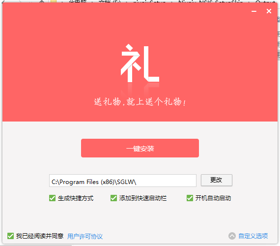
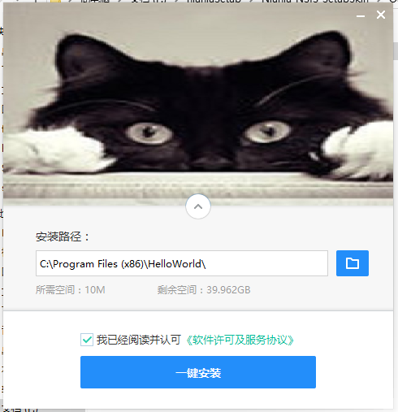

# NSIS-UI
Пакет NSIS exe, средство управления украшением интерфейса установочного пакета Niuniu [nsNiuniuSkin], содержит 3 примера, последние два взяты с официального сайта, а helloworld модифицирован на основе двух вышеупомянутых примеров.
# 说明：
1. Я работаю в Интернете. Я не понимаю, как это делать, но просто скопируйте их. Пожалуйста, не консультируйтесь со мной по поводу упаковки программного обеспечения. Я действительно не могу вам помочь.  
2. Проект представляет собой веб-сайт, созданный на электронном носителе и упакованный электронным упаковщиком. Те, кто пользовался электронным упаковщиком, знают, что упакованная версия на самом деле является зеленой версией, много файлов,
Поэтому его удобно использовать в виде установочного пакета. Вначале я использовал InnoSetup. Процесс производства и интерфейс относительно просты. Это стиль win2000? Я не был удовлетворен покупателем, поэтому поискал
Чтобы украсить интерфейс программного пакета, я нашел плагин nsNiuniuSkin, который был реализован путем объединения Duilib и NSIS. Конечно, InnoSetup тоже можно реализовать, но мы не будем, будем использовать уже готовые.
3. Поместите изображение эффекта ниже

